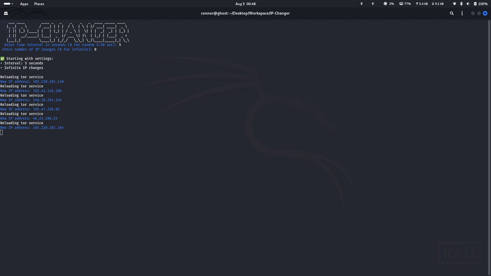
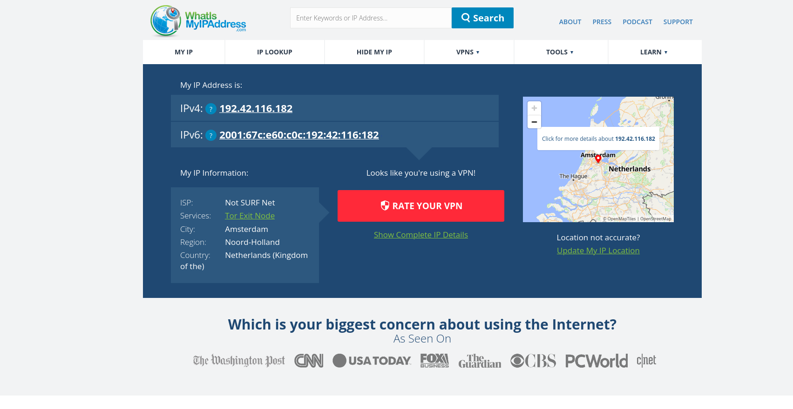
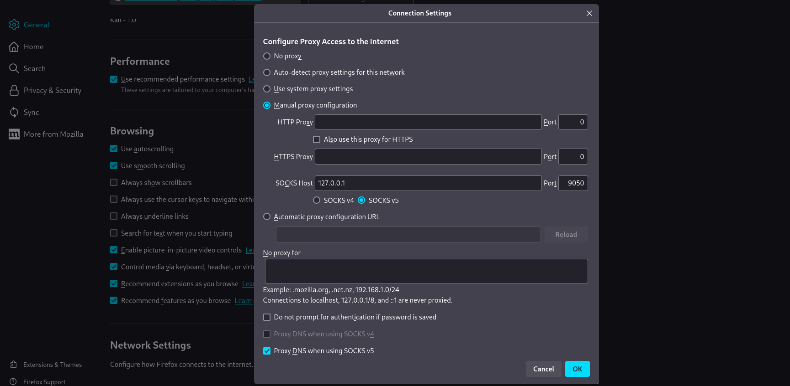

# 🔄 Tor IP Changer Script

- This Bash script automates the process of changing your public IP address using the Tor network. It supports most major Linux distributions and includes installation, setup, and dynamic IP rotation with customizable intervals.




---

## ⚙️ Features

- 🧪 Automatically installs `curl` and `tor` if not present

- 📦 Supports:

  - `apt` (Debian, Ubuntu)

  - `yum` (Fedora, CentOS, RHEL, Amazon Linux)

  - `pacman` (Arch Linux)

- 🔄 Automatically starts and reloads Tor service

- ⏱️ Set a fixed interval or use random (5–30 sec) between IP changes

- 🔁 Choose between finite or infinite number of IP changes

- 🌐 Retrieves and displays current IP through Tor exit node

---

## 🚀 How to Use

###  Make the script executable

```bash
chmod +x IP-Changer.sh
```
### Run script as root 
```
sudo ./IP.Changer.sh
```


## Browser Proxy Config
- Add custom proxy to browser to use tor IP it is entry node to tor network to use the random IP given by tor 
- Open browser Navigate to General -> Network Settings 
- There Enable Manual Proxy Config
- Enter SOCKS host as 127.0.0.1 - This is tor network default Gateway 
- Then select SOCKsv5 
 - These Instruction are for firefox configutration is same settings path can be different.


---
- First, enter how long you want to stay on one server before changing the IP.
Then, enter how many times to change the IP. Enter 0 for unlimited changes.

---
## If automatic installation of tor fails please proceed manually tor on kali [Tor Installation](https://www.kali.org/docs/tools/tor/)